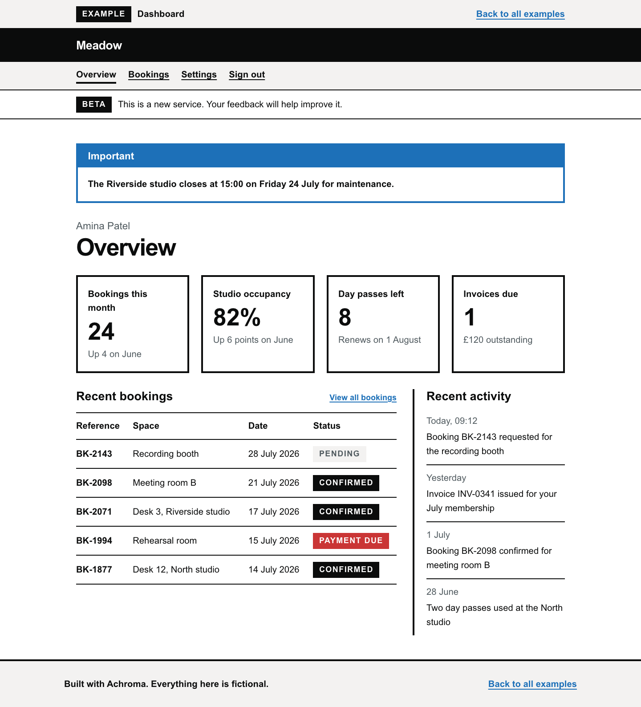

# Achroma



A monochrome design system inspired by the [GOV.UK Design System](https://design-system.service.gov.uk/). React 19, Tailwind CSS 4, Vite, TypeScript.

## Principles

- Colour carries meaning, nothing else: blue for links and information, red for errors, green for success, yellow for focus.
- Native controls (checkboxes, radios, selects, details) over custom widgets.
- Visible focus everywhere, WCAG 2.2 AA contrast.
- One question per page. Check answers before submit. Confirm completion.
- Primitives are Tailwind `@utility` classes (`btn`, `form-input`, `tag`). React components only where there is structure.

## Examples

Five apps built with the system, indexed at `#/examples`: dashboard, bookings data table, settings, sign-in with validation, membership application.

## Commands

```sh
npm install
npm run dev      # start dev server
npm run build    # type-check and build to dist/
npm run lint     # oxlint
```
